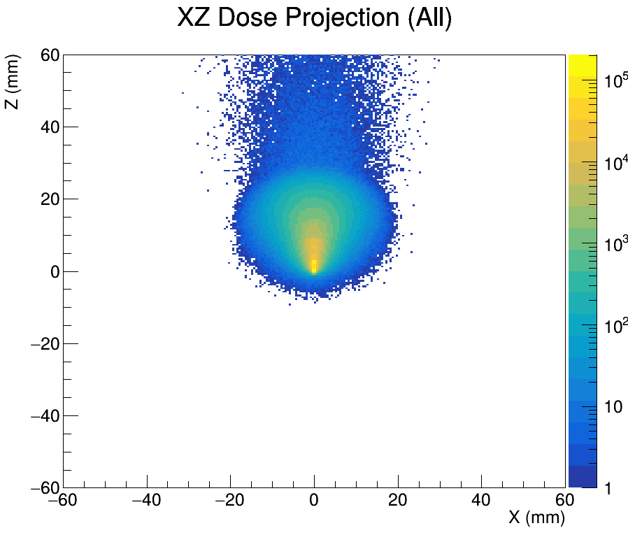
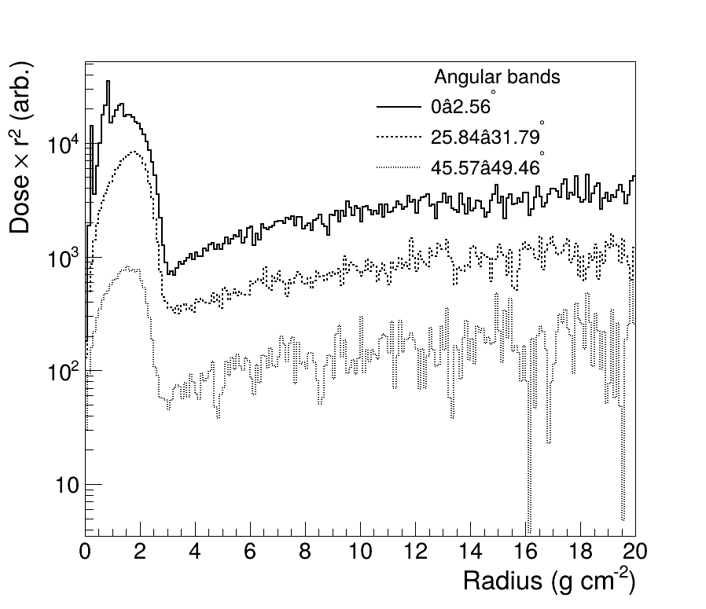
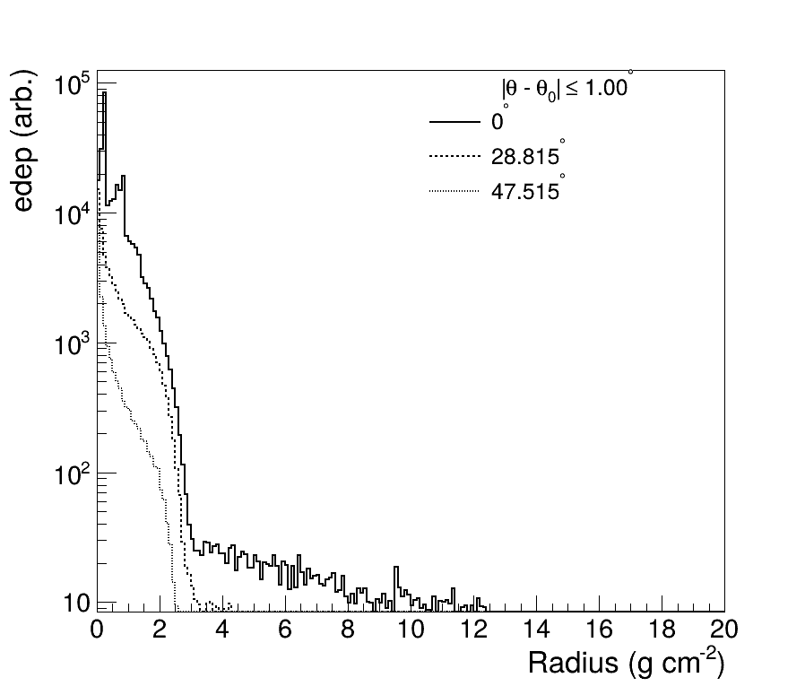

# Kernel generation on GEANT4
**Photon energy-deposition kernels in water with lineage tagging and ROOT analysis**

**Author:** Rohit Inippully  
**Affiliation:** Illawarra Cancer Care Centre  

---

## Overview
This project simulates **monoenergetic photon energy-deposition kernels** in water using **GEANT4** and analyzes them with **ROOT**. The implementation tags dose by **interaction lineage** (Compton with scatter order, Photoelectric, Pair, Bremsstrahlung-photon, Annihilation-photon) and provides scripts to reproduce classic kernel plots (polar isodose lines, r²-weighted radial curves, and ray-wise depth/radius scans).

**Key features**
- **Lineage tagging** via an `InteractionType` enum (Brem/Annihil lineages preserved across downstream interactions).
- **Kernel origin** defined at the **first inelastic photon interaction** (for Brem/Annihil photons) or the **first photon interaction** (for normal/scattered photons).
- **Compton scatter order** recorded at each photon interaction and carried by all secondaries from that event.

---

## Environment & Build

- **GEANT4:** 11.0.2  
- **ROOT:** 6.36.02  
- **CMake:** ≥ 3.16 (recommended)

### Quick version checks
```bash
geant4-config --version
root-config  --version
```

### Build (example)
```bash
# Setup your environments first (paths will vary)
source /path/to/geant4/bin/geant4.sh
source /path/to/root/bin/thisroot.sh

mkdir -p build && cd build
cmake .. -DCMAKE_BUILD_TYPE=Release
make -j
```

---

## Simulation specifics

- **Medium:** Water (ρ≈1 g·cm⁻³)
- **Phantom:** 1 m × 1 m × 2 m (Z dimension = 2 m)
- **Primary:** Monoenergetic **gamma** source at **(0, 0, 0)**
- **Production cuts:**  
  `defaultCutValue = 0.1 * mm;`
- **Physics lists:**  
  ```cpp
  emPhysicsList  = new G4EmStandardPhysics_option4();
  decPhysicsList = new G4DecayPhysics();
  ```
- **Scoring output:** ROOT `TTree` (see **Data format**)

### Batch over energies
`runAllEnergies.sh`:
```bash
#!/bin/bash
energies=$(seq 0.1 0.1 1.0)
for E in $energies; do
    energy="${E}MeV"
    echo "Running simulation for energy: $energy"
    ./exampleB4c -t 8 -m run2.mac -e $energy
done
```

**`run2.mac` essentials**  
Add your event count (primaries) and any UI commands you use, for example:
```tcl
# /run/verbose 1
# /event/verbose 0
# /tracking/verbose 0

# TODO: set the energy via your app’s messenger if needed
# /gun/energy 0.6 MeV

# Number of primaries
# /run/beamOn 100000000   # TODO: replace with actual N
```

> **Action:** Replace the `TODO` lines with your actual macro commands and `/run/beamOn` count.

---

## Data format (ROOT `TTree`)

- **Tree name:** `DoseData`
- **Branches:**
  - `X, Y, Z` — position in **mm** (of the energy deposit step)
  - `edep` — energy deposited **(units: _TODO_: MeV per primary? Gy per primary?)**
  - `Type` — integer code from `InteractionType` (see table)
  - `Scatter` — **photon Compton scatter order** (1,2,3,…) or **−1** if not applicable

### `InteractionType` mapping

| Code | Meaning |
|---:|---|
| 0 | Gamma (bookkeeping; photons typically don’t deposit) |
| 1 | Compton (lineage; **Scatter** column carries order) |
| 2 | Photoelectric |
| 3 | Bremsstrahlung-photon lineage |
| 4 | Annihilation-photon lineage |
| 5 | Pair production |
| 6 | Rayleigh (optional) |
| 9 | Unknown |

**Notes**
- **Brem/Annihil photons** are tagged at creation (`creator == eBrem/annihil`), **origin cleared**, and the **origin is set at their first inelastic** photon interaction (`compt/phot/conv`).
- **δ-electrons** from `eIoni/ionIoni` **inherit** their parent lineage and origin.
- **Scatter order** is incremented only at **photon interactions** and is **not** modified during electron transport.

---

## Running the simulation

From the build directory (example):
```bash
./exampleB4c -t 8 -m run2.mac -e 0.6MeV
# outputs (example) -> DoseKernel_0.6MeV.root
```
> **Action:** Document the actual output file naming convention (e.g., `DoseKernel_<ENERGY>.root`).

---

## Analysis (ROOT)

Scripts live in `analysis/`. All run in **one pass** over the tree with cached I/O.

```bash
# 2D heatmaps by lineage category (single pass)
root -l -q 'root_scripts/plot.cpp("DoseKernel_0.6MeV.root")'

# Contours-only (rectangular)
root -l -q 'root_scripts/contours.cpp("DoseKernel_0.6MeV.root")'

# r^2-weighted radial curves for angle bands
root -l -q 'root_scripts/plot_r2_angular.cpp("DoseKernel_0.6MeV.root")'

# edep vs radius along thin rays
root -l -q 'root_scripts/plot_radial.cpp("DoseKernel_0.6MeV.root")'
```

Default assumptions inside scripts:
- **Water equivalence**: 1 g·cm⁻³ → 1 g·cm⁻² ≡ 10 mm (radius axis)
- **Mid-plane slice:** `|y| ≤ 0.25 mm`
- **Forward hemisphere:** `z ≥ 0`  
You can override these via function arguments.

---
## Results and Visualizations

### Figure 1 – 2D Dose Kernel Projection
<p align="center">
  
</p>
<p align="center">
  <b>Figure 1.</b> Two-dimensional energy-deposition kernel in water for a monoenergetic photon beam simulated in GEANT4. The plot shows the XZ mid-plane projection (|y| ≤ 0.25 mm) with a logarithmic colour scale (1 → 10⁵ arb.). The kernel is forward-peaked, with lateral broadening at depth due to multiple scatter.
</p>

---

### Figure 2 – r²-Weighted Radial Profiles
<p align="center">
  
</p>
<p align="center">
  <b>Figure 2.</b> r²-weighted radial dose profiles for selected angular bands. The near-axis band dominates; flattening at large radii indicates energy conservation under r² weighting.
</p>

---

### Figure 3 – Radial Energy Deposition per Ray
<p align="center">
  
</p>
<p align="center">
  <b>Figure 3.</b> Energy deposition versus radius for discrete angular rays. Steep near-axis fall-off and broad scatter tails are consistent with classical photon kernel behaviour.
</p>

---

## References
- Mackie TR, et al. *Generation of photon energy deposition kernels using the EGS Monte Carlo code*. **Phys Med Biol** (1988).
- Ahnesjö A. *Collapsed cone convolution of radiant energy for photon dose calculation in heterogeneous media*. **Med Phys** (1989).
- Ahnesjö A, Aspradakis MM. *Dose calculations for external photon beams in radiotherapy*. **Phys Med Biol** (1999).

---

## Contact
**Rohit Inippully** — Illawarra Cancer Care Centre  
Email: rohit.inippullysomasundaran@health.nsw.gov.au 

---

